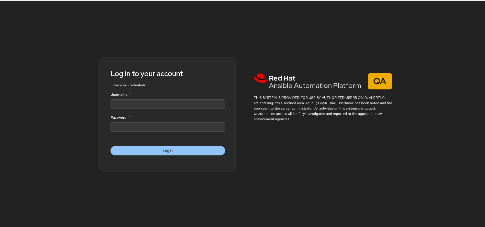
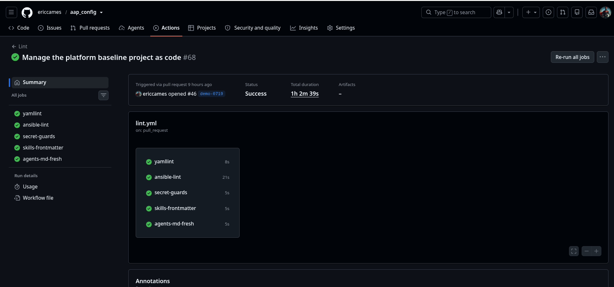
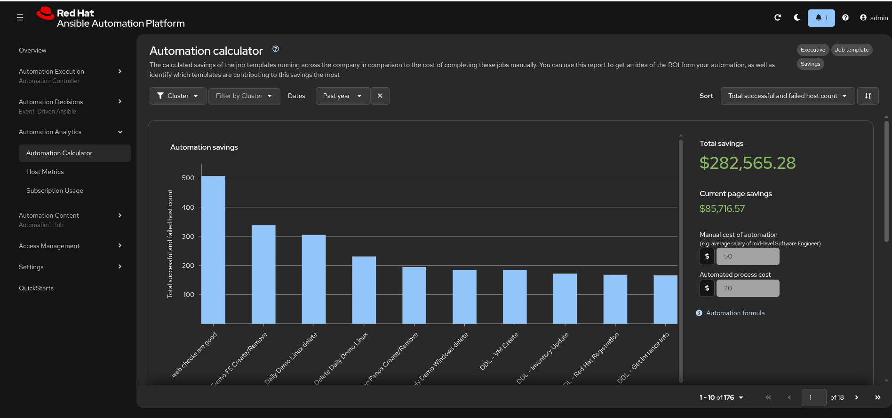

# DEMO — the config-as-code loop in about 10 minutes

A demo script for a **technical audience** — sysadmins and platform engineers who
will actually run this. It shows the loop end to end without walking through
runbooks 00–07.

The runbooks teach. This shows. If someone in the room wants to *learn* it
afterwards, hand them [`README.md` → Start here](README.md#start-here).

---

## Before you stand up

Two questions decide which version of this demo you give. Answer them honestly —
the failure mode for this demo is discovering mid-session that a step needs
something you don't have.

**1. What can you reach?**

| What you have | What you can run |
|---|---|
| **A source AAP** (export from) | Act 1 live |
| **A target AAP** (apply to) | Act 4 live |
| **Neither** | Everything except Act 1 and Act 4 — see [No AAP handy](#no-aap-handy) |
| **GitHub Actions** — nothing to set up | Act 3 live. The five PR checks in `lint.yml` run on GitHub-hosted runners, so they work on this repo as-is. Only demoing a **deploy workflow actually firing** needs setup: a self-hosted runner labeled `self-hosted, linux, aap` plus the four GitHub Environments and their `VAULT_PASSWORD` secrets ([`docs/github-setup.md`](docs/github-setup.md)). Act 4 applies locally on purpose, so the demo never depends on that. |

> Demoing from a copy in a customer's **GitHub Enterprise Server**? GHES has no
> hosted runners by default, so even the lint checks need a self-hosted runner —
> a one-line `runs-on:` change, noted at the top of
> [`.github/workflows/lint.yml`](.github/workflows/lint.yml). Demo from your own
> GitHub repo and this does not come up.

**2. Has this repo been through the loop already?** If `inventory/group_vars/aap/`
holds nothing but `aap_settings.yml`, no objects have been curated yet, so Act 2
is a genuine first-time edit rather than a replay. That is fine — it is arguably
more honest — but you should have decided which object you are going to curate
*before* you start talking.

**Rehearse it once.** Run the whole thing start to finish the day before, against
the same environment, with the same terminal. This script assumes you have.

### Act 2's object

Decided in advance, and chosen because it is the one project in the export that
does **not** already exist on the target:

| | |
|---|---|
| **Object** | `AMZL Daily Demo` project |
| **From** | `exports/azure/IT Service Automation/controller_projects.d/11_AMZL Daily Demo.yaml` |
| **To** | `inventory/group_vars/aap/controller_projects.yml`, key `controller_projects_all` |
| **Why this one** | `Demo Project` and `Ansible Product Demos` already exist on the target with identical SCM URLs, so curating either gives Act 4 a `changed=0` anticlimax. Its SCM repo is public, so no credential is needed. |

**Check the target before you rely on this.** Environments drift, and the whole
point is that Act 4 creates something visible:

```bash
# Does the object already exist on the target? If yes, pick another.
curl -sk -u "$AAP_USER" "$AAP_HOST/api/controller/v2/projects/" | jq -r '.results[].name'
```

### Two optional extras, if the room is engaged

Both come from the **gitignored** `*_settings*` exports, so they are curated by
hand, key by key — which is itself the point runbook 03 makes about settings.

**Pre-login banner** — `inventory/group_vars/aap/gateway_settings.yml`:

```yaml
gateway_settings_all:
  custom_login_info: >-
    THIS SYSTEM IS PROVIDED FOR USE BY AUTHORIZED USERS ONLY. ...
```

The best payoff-per-second in the whole demo: it renders on the AAP **sign-in
page**, so proving the apply landed needs no object page and no navigation. Log
out and show them.

**Automation analytics** — `inventory/group_vars/aap/controller_settings.yml`:

```yaml
controller_settings_all:
  settings:
    INSIGHTS_TRACKING_STATE: true
    AUTOMATION_ANALYTICS_URL: "https://cloud.redhat.com/api/ingress/v1/upload"
    AUTOMATION_ANALYTICS_GATHER_INTERVAL: 14400
    SUBSCRIPTIONS_CLIENT_ID: "{{ vaulted_subscriptions_client_id }}"
    SUBSCRIPTIONS_CLIENT_SECRET: "{{ vaulted_subscriptions_client_secret }}"
```

This is the strongest argument in the kit for the secrets model, because the
credentials **cannot** come from the export — AAP returns them as `$encrypted$`,
never in the clear. So the config is in Git and the secret is in the vault, and
the setting simply does not work without both. Requires
`vaulted_subscriptions_client_id` / `_client_secret` in the environment's
`secrets.yml` (`ansible-vault edit`).

Do **not** curate `AUTOMATION_ANALYTICS_LAST_GATHER`, `LAST_ENTRIES`, `LICENSE.*`,
or `INSTALL_UUID` — runtime state and subscription identifiers, not config.

**Environment badge** — `inventory/group_vars/qa/gateway_settings.yml`. The only
**per-environment** file in the repo, and the one place Act 2's `_all` / `_<env>`
claim becomes something you can point at:

```yaml
gateway_settings_qa:
  custom_logo: "data:image/png;base64,{{ lookup('ansible.builtin.file', inventory_dir + '/../docs/images/logo-qa.png.b64') }}"
```

`gateway_settings_all` (the banner, shared) and `gateway_settings_qa` (the logo,
qa only) **merge** — dispatch combines mappings recursively. Show both files
side by side: one definition set, one environment-specific delta, no duplicated
copies. That is the whole argument for the suffix convention in ten seconds.

The image extends the official product lockup with a color-coded badge —
`utilities/make-env-logo.py --env QA`, amber for qa, green dev, red prod.

**Be accurate about where it appears:** the **sign-in page**, not the masthead.
`custom_logo` does not change the post-login header — that is a bundled UI asset,
and AAP 2.7 has no setting that marks the environment after login. Say "you see
which environment you are entering before you touch anything," and do not claim
a persistent banner. Someone in the room will check.

Both extras land on the same screen, which is why this one shot carries the
section — the shared banner and the qa-only badge, from two files that merged:



### Preparing the target — required

Two conditions must hold before you start: the **organization must exist**, and
the **project must not**.

The organization is committed config — `inventory/group_vars/aap/aap_organizations.yml`
holds `aap_organizations_all`, so it is created by config-as-code like anything
else. On a brand-new AAP, one apply establishes it:

```bash
# On a fresh target: creates IT Service Automation and nothing else.
ansible-playbook playbooks/config.yml -i inventory --limit qa \
  --vault-id qa@~/secrets/.vault_pass_qa 2>&1 | tee /tmp/demo-prep.log
```

Then make sure the project is absent, so Act 4 creates it in front of them:

```bash
curl -sk -X DELETE -u "$AAP_USER" "$AAP_HOST/api/controller/v2/projects/<id>/"
```

**Why the org must pre-exist.** `validate.yml` runs in **check mode**, which does
not create anything. If the organization is missing, check mode cannot create it,
so validating the project that references it **fails** — and your "dry run first,
always" safety step becomes the thing that breaks on stage. Keeping the org in
committed config means every environment gets it automatically and this never
comes up. It is a real limitation of check mode with new dependent objects, not a
bug in the config.

During Act 4 the org reports no change (it is already there) and the project is
created. That is the intended shape: standing config stays converged, and the
thing you curated live is the thing that appears.

### Where you run it

**Your laptop's dev container.** It already holds the two things this demo
depends on: the vault password files in `~/secrets/` and the Automation Hub
token in `~/.ansible.cfg`. A codespace has neither, and putting them there means
a Codespaces secret written to a file at container start — which undoes the
reason for not typing passwords live. No image build to wait on, no idle
timeout, one less network hop.

Codespaces still earns its place in this demo twice: as the **audience's**
on-ramp (the badge in the README — they can try the repo without installing
anything), and as your **cold backup** if the laptop dies, accepting that you
will be typing vault passwords for that run.

### Setup checklist

```bash
# In the dev container, from the repo root:
ansible --version                                              # ansible-core 2.16.x
ansible-galaxy collection list | grep infra.aap_configuration  # 4.7.0
gh auth status                                                 # logged in
ls -la ~/secrets/                                              # .vault_pass_azure, .vault_pass_qa — both mode 600
git switch -c demo-$(date +%m%d) && git status                 # clean tree, demo branch

export ANSIBLE_FORCE_COLOR=1                                   # keep color through the tee below
```

`ls -la`, not `ls -l` — the password files are dotfiles, so plain `ls -l` reports
an empty directory whether they are there or not.

Missing a vault password file? Create it once, outside the repo:

```bash
# Prompts for the password; refuses to overwrite a file that already exists.
( set -o noclobber
  read -rsp 'qa vault password: ' PW && printf '%s' "$PW" > ~/secrets/.vault_pass_qa
  unset PW; echo )
chmod 600 ~/secrets/.vault_pass_qa
```

`read -rs` keeps the password out of your shell history, and `noclobber` makes
the `>` fail rather than destroy a password file you already had. **Never paste a
literal password into a command in this file** — a rehearsal that pastes the
whole block would otherwise overwrite a working key with whatever placeholder is
printed here, and the vaulted file would then be unopenable.

A trailing newline is harmless either way — Ansible strips it — so an editor
works fine too.

Have a second terminal open on the repo, and a browser tab on the repo's
**Actions** tab. This script assumes **Claude Code** as the assistant — the
skills also work in Copilot CLI, which is a point worth making in Act 2, but
pick one before you start rather than switching mid-demo.

---

## The one-sentence framing

> Your AAP configuration stops being something you click together in a UI and
> becomes something that lives in Git, gets reviewed like code, and is applied by
> a pipeline — with the same objects promoted through dev, qa, and prod.

Show [`docs/ARCHITECTURE.md`](docs/ARCHITECTURE.md) or the ASCII diagram in the
README for thirty seconds, then stop talking and start running things.

---

## Act 1 — Export: get what's already there into Git *(~2 min)*

*Needs a source AAP. Skip to Act 2 if you don't have one.*

The point to land: **nobody hand-writes this**. You start from what is already
running in production, and the export is read-only.

```bash
ansible-playbook playbooks/export.yml -i inventory --limit azure \
  --vault-id azure@~/secrets/.vault_pass_azure 2>&1 | tee /tmp/demo-export.log
```

> `<env>@<file>` reads the vault password from disk instead of prompting. The
> runbooks teach `--vault-id azure@prompt`, and that is the right default for a
> person at a keyboard — but a demo should never stall on a mistyped password.
> If either playbook prompts you, the path is wrong.

While it runs, say what it is doing: `filetree_create` walks the controller and
gateway APIs and writes one file per object into `exports/`. It mints a
read-scoped OAuth token and deletes it in an `always:` block, so nothing is left
behind on the platform.

Then the part a security-minded audience cares about:

```bash
bash utilities/scan-exports.sh
```

Secret fields never come out in the clear — `secrets_as_variables: true` templates
them to `{{ vaulted_* }}` placeholders, and this guard fails the run if anything
secret-shaped slipped through. It runs in the pre-commit hook and in CI too.

```bash
ls exports/azure/
```

Real objects, one file each, committed for review.

---

## Act 2 — Curate: decide what is actually config *(~2 min)*

Export is a snapshot; **config-as-code is a decision about what you intend to
manage.** This is the step people underestimate.

**The object to curate is decided in advance** — see [Act 2's object](#act-2s-object)
below. Move it:

```bash
# Shared by every environment:
#   exports/azure/IT Service Automation/controller_projects.d/11_AMZL Daily Demo.yaml
#     -> inventory/group_vars/aap/controller_projects.yml
#     and rename the top-level key to controller_projects_all
```

Three things to call out while you edit:

- **The `_all` / `_<env>` suffix.** `controller_projects_all` is shared;
  `controller_projects_dev` is a dev-only delta. They merge at apply time. That
  is how one repo serves four environments without four copies.
- **The export's key is not always the variable that gets read.** Projects are
  easy — `controller_projects` → `controller_projects_all`. But the *organization*
  export writes `gateway_organizations:`, while the role reads **`aap_organizations`**,
  so the curated key is `aap_organizations_all`. Copy-plus-suffix would produce a
  file that loads and silently does nothing. When in doubt, check
  `infra.aap_configuration/roles/dispatch/defaults/main.yml` — the `var:` field
  next to each role is the name that counts. This is a good place to let the
  audience watch you check rather than assert.
- **Variables load implicitly from `inventory/group_vars/`** — there is no
  `vars_files:` or `include_vars:` anywhere in this repo, by design. Environment
  is selected with `--limit`. This is the Red Hat Services standard, and it is
  the single most common thing people get wrong.

If the audience is AI-curious, this is the strongest place to show a skill —
`/curate-config` does exactly this move and knows the suffix rule:

```
/curate-config
```

Worth naming: these skills use the open `SKILL.md` format and work in **both**
Claude Code and GitHub Copilot CLI. Same files, either tool — nobody is locked in.

---

## Act 3 — Review: the guardrails are the product *(~3 min)*

This is the act that separates config-as-code from "we put some YAML in Git", so
give it the most time.

```bash
git add inventory/group_vars/aap/controller_projects.yml
git commit -m "Manage the platform baseline project as code"
git push -u origin demo-$(date +%m%d)
gh pr create --fill
```

Switch to the Actions tab and let five checks run in front of them:

| Check | What it stops |
|---|---|
| `yamllint` | Malformed YAML |
| `ansible-lint` | Playbook and syntax problems |
| `secret-guards` | A plaintext `secrets.yml` or a leaked secret in `exports/` |
| `agents-md-fresh` | Docs drifting from the directory layout |
| `skills-frontmatter` | An AI skill that would silently stop loading |



Worth saying out loud while it is on screen: the whole gate finishes in well
under a minute of job time. Guardrails that cost a coffee break get disabled;
these do not.

Then the line that usually lands hardest — **try to commit a secret in front of
them**:

```bash
echo 'aap_password: "hunter2"' > inventory/group_vars/dev/secrets.yml
git add inventory/group_vars/dev/secrets.yml && git commit -m "oops"
```

The commit is refused, because `secrets.yml` is not vault-encrypted:

```
ERROR: not vault-encrypted: inventory/group_vars/dev/secrets.yml
       Encrypt it:  ansible-vault encrypt '...' --vault-id <env>@prompt
check-vault-encrypted: FAILED — plaintext secrets file(s) found.
```

The same guard runs in CI, so it holds even for someone who skipped the hook.
Clean up:

```bash
git restore --staged inventory/group_vars/dev/secrets.yml
rm inventory/group_vars/dev/secrets.yml
```

> Practice this bit. **Use `dev/` on purpose** — `dev/secrets.yml` does not
> exist, so the `>` creates it and nothing real is at risk. Do **not** point this
> at `qa/`, which now holds a real vault-encrypted `secrets.yml` that `>` would
> destroy. Cleanup is `rm` and **not** `git checkout --`, which fails on an
> untracked file.
>
> Never type a real credential here. `hunter2` is [bash.org quote
> #244](https://bash-org-archive.com/?244) — a 2004 IRC log where a user whose
> client masks passwords as `*******` concludes that everyone's password displays
> that way, and helpfully types his real one. It has been the internet's
> universal obviously-fake password ever since, which is exactly why it belongs
> here: nobody in the room mistakes it for a live credential.

The secrets model in one breath: everything sensitive lives in one
vault-encrypted `secrets.yml` per environment — connection credentials *and*
object secrets — and CI needs exactly one `VAULT_PASSWORD` per GitHub
Environment. If they run BeyondTrust, CyberArk, or HashiCorp, point at
[`docs/secrets-beyondtrust.md`](docs/secrets-beyondtrust.md) as the worked
example of backing those values with an external manager.

Merge the PR.

---

## Act 4 — Apply: it shows up in AAP *(~3 min)*

*Needs a target AAP. If you don't have one, see [No AAP handy](#no-aap-handy).*

**Dry run first — always:**

```bash
ansible-playbook playbooks/validate.yml -i inventory --limit qa \
  --vault-id qa@~/secrets/.vault_pass_qa 2>&1 | tee /tmp/demo-validate.log
```

`validate.yml` is `config.yml` in check mode. It reports what *would* change and
changes nothing. Read the intended changes out loud — this is the "no surprises"
promise, and it is what makes the pipeline safe to hand to someone junior.

```bash
ansible-playbook playbooks/config.yml -i inventory --limit qa \
  --vault-id qa@~/secrets/.vault_pass_qa 2>&1 | tee /tmp/demo-config.log
```

Now the payoff: **switch to the AAP UI and show the object**. Don't narrate it,
just show it.

If analytics is curated, the stronger payoff is **Automation Analytics →
Automation Calculator** — real job-template data and a savings figure. That is an
executive artifact, not a sysadmin one, and it lands with people who do not care
what a project is.



The two input boxes — manual cost per hour and automated process cost — are
theirs to argue with, and letting them change the numbers on the spot is better
than defending yours. The template names are the demo's own, so the shape of the
chart is the honest part: a long tail of routine work, priced.

Then run the apply a second time. **Expect `changed=1`, not `changed=0`** — and
say why before anyone asks:

> AAP returns `SUBSCRIPTIONS_CLIENT_SECRET` as `$encrypted$` and never in the
> clear, so config-as-code cannot compare what it wants against what is there.
> It rewrites the secret every run. That one change is the platform refusing to
> hand back a secret — not drift.

Verified: remove that one line and two consecutive runs both report `changed=0`;
leave it in and every run reports `changed=1`.

Handled well this is a *better* moment than a clean `changed=0`, because it sets
up the real point: **counting changes is not drift detection.** That is what
`object_diff` is for — see [`docs/phase-3-plan.md`](docs/phase-3-plan.md). If you
want the clean `changed=0` instead, drop `controller_settings.yml` from the
curated set for that run; everything else in the kit is genuinely idempotent.

Close the loop: in the real flow, merging to `main` triggers `deploy-dev.yml`
automatically; qa and prod are `workflow_dispatch` with required reviewers on
their GitHub Environments. Production is an active/passive pair that receives
identical config, with one variable — `aap_site_role` — deciding which side's
schedules and notifications are live. Failover is swapping that value, not
re-running a migration.

---

## If something breaks mid-demo

Every playbook run above is teed to a log, so a failure that scrolled off the
screen is still recoverable without re-running anything in front of the room:

```bash
grep -nE 'FAILED|fatal:|unreachable' /tmp/demo-export.log   # or demo-validate / demo-config
tail -40 /tmp/demo-export.log                               # the PLAY RECAP and what led to it
```

Read the recap out loud rather than hiding it. A technical audience has seen
playbooks fail before; narrating the failure and pointing at the log is more
credible than a demo that never breaks.

The three failures worth recognizing on sight:

| What you see | What it means |
|---|---|
| A **vault password prompt** | The `--vault-id` path is wrong or the file is missing. Nothing has run yet — `ls -la ~/secrets/` and retry. |
| `infra.aap_configuration_extended is not installed` | `AH_TOKEN` was not set when the container started. `bash .devcontainer/post-create.sh` inside the container. |
| `changed=N` but `git status` is clean | Not a failure. `filetree_create` rewrites files with identical content and still reports `changed` — git is the honest signal for whether anything actually moved. Useful to say out loud in Act 1. |

> Because of the `| tee`, `$?` is tee's exit status, not the playbook's. If you
> script anything around these, use `${PIPESTATUS[0]}`.

The export playbook deletes its OAuth token in an `always:` block, so even a
mid-run failure leaves nothing behind on the platform — worth saying if Act 1 is
the thing that breaks.

---

## No AAP handy

Cut Acts 1 and 4 and run **Act 2 → Act 3** as the whole demo. You lose the "it
appeared in the UI" moment, but the guardrails act is the part technical audiences
argue about anyway, and every command still runs for real.

Substitute for the payoff: open `exports/azure/` to show what a real export looks
like, then walk [`docs/ARCHITECTURE.md`](docs/ARCHITECTURE.md) for where the
pipeline goes. Be straightforward that you are showing the repo rather than a live
apply — a technical audience will respect that far more than a demo that stalls on
a connection error.

---

## Questions you will get

**"Why not just use the AAP UI, or a backup/restore?"** Backup restores an
instance; this promotes *intent* through environments. The same definitions build
dev, qa, and both prod sides, and every change is reviewable and revertable.

**"What happens if someone changes it by hand in the UI?"** Today, the next apply
puts it back. Scheduled drift detection using `object_diff` is designed in
[`docs/phase-3-plan.md`](docs/phase-3-plan.md) — report-first, never auto-delete.

**"Does this need Ansible expertise?"** No, and that is the point of the runbook
path — it is written for people with little Git or software-development
experience, on Windows, in a dev container, with an AI assistant at each step.

**"Where do the collections come from?"** Automation Hub, via `AH_TOKEN` — Red Hat
certified content (`ansible.platform`, `ansible.controller`) and validated content
(`infra.aap_configuration*`), pinned in
[`collections/requirements.yml`](collections/requirements.yml). That token is the
moment the kit reaches into their AAP subscription; see the README's
"Where the subscription fits".

**"Can we run this on our GitHub Enterprise?"** Yes — see
[`docs/duplicating-into-enterprise-github.md`](docs/duplicating-into-enterprise-github.md).
On GHES without hosted runners, the workflows need self-hosted runners with
network reach to the gateways; that is one line in each workflow.

**"What would it take to actually adopt this?"** That is a different conversation
from this demo:
[`docs/going-to-production.md`](docs/going-to-production.md) lists the
workstreams, and [`docs/tam-adoption-plan.md`](docs/tam-adoption-plan.md) is a
one-page plan to fill in with their TAM. Good leave-behinds.

---

## Screenshots to capture

Three captured and embedded above, in Acts 2, 3 and 4. Grab the rest during the
next rehearsal. They go in [`docs/images/`](docs/images/), committed so they
render on GitHub, and they turn this script into something that still lands when
the environment is down.

| # | Act | The moment | Status |
|---|-----|-----------|--------|
| 0 | 2 | The qa sign-in page — badge and banner together | ✅ `qa-signin-badge-banner.png` |
| 1 | 4 | The object in the AAP UI, right after `config.yml` — the payoff, and the shot you cannot recreate later |  |
| 2 | 4 | The Automation Calculator with real savings data — the executive payoff | ✅ `automation-calculator.png` |
| 3 | 3 | The five green checks on the PR in the Actions tab | ✅ `lint-checks-green.png` |
| 4 | 3 | The pre-commit hook refusing the `hunter2` commit |  |
| 5 | 2 | `/curate-config` running in Claude Code |  |

Shot 1 is the priority — the only one left that needs a live AAP, so it is the
one you lose if the environment is unreachable on the day. Shots 4 and 5 are
local and can be grabbed any time.

---

## After the demo

```bash
git switch main && git pull
git branch -d demo-<date>
git push origin --delete demo-<date>
```

Point them at [`README.md`](README.md) to start the runbooks themselves, and at
the Codespaces badge if they want a working environment without installing
anything.
