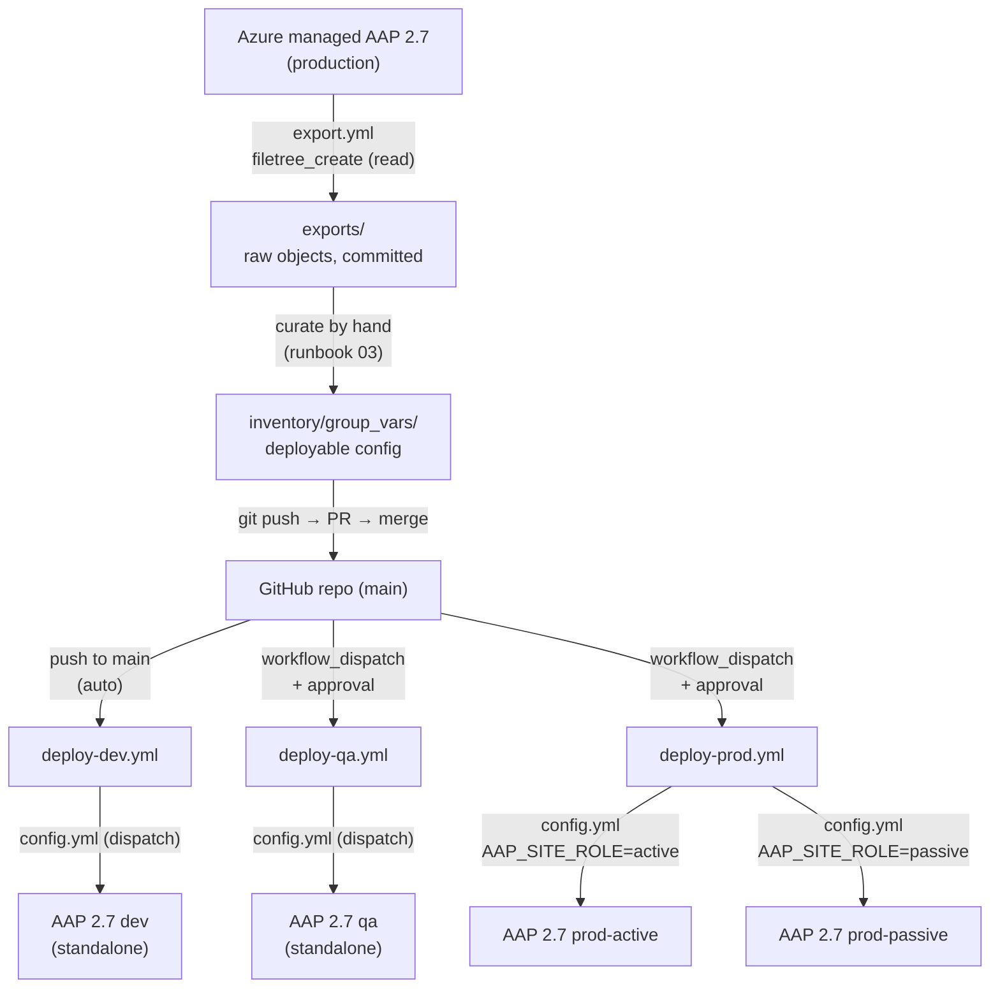

# Architecture

## The flow



## Two ways in, one way out

- **Export (Priority 1)** runs from the trainee's laptop dev container against the
  Azure production instance. It only reads. Output lands in `exports/` for review;
  Git operations are done by the trainee, not the playbook.
- **Load (Priority 2)** runs from **self-hosted GitHub Actions runners** that sit
  on-prem with network reach to the dev/qa/prod gateways. The runner applies the
  curated `inventory/group_vars/` config with `config.yml`.

## Active/passive production topology

Production runs as an **active/passive pair**. Both sides receive the **same
config from the same commit, simultaneously** (two parallel jobs in
`deploy-prod.yml`). The only behavioral difference is the `aap_site_role`
variable, set from the `AAP_SITE_ROLE` env var:

- **`active`** — schedules, notifications, and webhook receivers are enabled.
- **`passive`** — those objects are present but disabled.

Curated object definitions use Jinja to gate on it:

```yaml
enabled: "{{ aap_site_role == 'active' }}"
```

**Failover** is an env-var change (or a load-balancer header flip) — no Git
commit, no PR, no wait. The passive side already has the full config.

This is the [Red Hat COP-recommended pattern](https://www.redhat.com/en/blog/automation-controller-active-passive-architecture-cac)
for active/passive CaC. More references in [`docs/references.md`](references.md).

## Why the pieces are where they are

| Choice | Reason |
|--------|--------|
| Objects in `inventory/group_vars/`, loaded implicitly | Red Hat Services standard; no `vars_files`/`include_vars` |
| One inventory, `--limit <env>` | Shared objects (`group_vars/aap/`) merge with per-env deltas |
| Self-hosted runners | GitHub's hosted runners can't reach on-prem AAP gateways |
| Per-environment GitHub Environments | Isolate dev/qa/prod secrets; add required reviewers to qa/prod |
| Basic auth for config/validate, token for export | Dispatch supports basic auth (nothing to clean up); `filetree_create` needs an OAuth token |
| Plain `ansible-playbook`, not ansible-navigator | Avoids EE-in-container on Windows Docker/Podman — the biggest support burden |
| `aap_site_role` from env var, not Git | Failover without a commit; COP-recommended pattern |

## What's deliberately not here

- No project-local `ansible.cfg` (would shadow the user's real one).
- No `galaxy.yml` (this is a project, not a collection — versions live only in
  `collections/requirements.yml`).
- No Automation Hub / EDA objects yet (scope is controller + gateway).
- No 2.4→2.5 conversion (source and target are both AAP 2.7).
