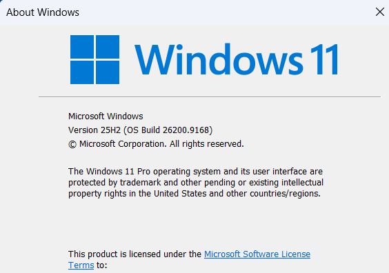
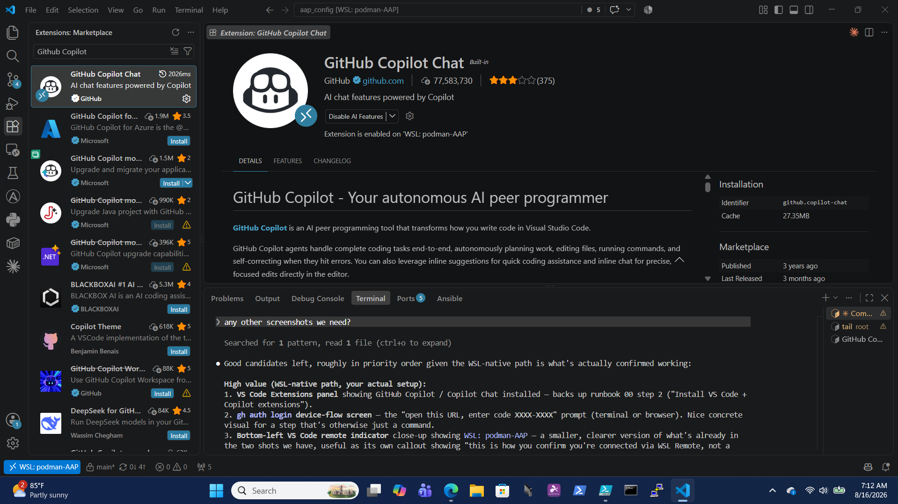
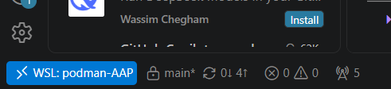

# Runbook 00 — Prerequisites

> **Skill:** `/setup-workstation` runs this whole runbook (it covers runbooks 00–01) for you, in Claude Code or GitHub
> Copilot CLI. Read the steps first, then let it drive.

## You will need

Needed either way:
- A **GitHub account** with access to your enterprise organization, and **GitHub
  Copilot** (a seat — we check it below).
- An **SSH key added to GitHub**, if you clone over SSH rather than HTTPS (see
  step 2 below).
- **VS Code**.
- A **Red Hat login** for Automation Hub (or your org's private hub URL + token).
- **AAP connection details** for the production (Azure) instance: URL, a service
  account username, and password.

Needed only for the devcontainer path (currently work in progress — see
[runbook 01](01-dev-environment.md#devcontainer-path-work-in-progress)):
- **Docker Desktop** *or* **Podman Desktop** on your Windows machine.
- The VS Code **Dev Containers** extension.

## You will learn

What each account/tool is for, and how to confirm your Copilot seat works.

## Preflight: can this Windows desktop run the dev container?

The dev container needs a Linux backend on Windows. Both Docker Desktop and
Podman Desktop run their containers on **WSL2** (or Hyper-V). On a locked-down
corporate desktop, WSL2 or hardware virtualization is sometimes disabled by IT
policy or firmware — and if it is, the dev container will not start at all.

Run this check **first**, before installing a container engine. It takes two
minutes and tells you whether this desktop can use the local dev-container path
or needs the fallback further down.

### Run the checks

Open **PowerShell** and run:

```powershell
winver                              # Windows 10 2004+ or Windows 11 required
wsl --status                        # is WSL present? what is the default version?
wsl --version                       # WSL app version — blank means not installed
systeminfo | findstr /i "Hyper-V"   # virtualization / Hyper-V requirements
```



Then the two checks that decide it in a managed environment (the second needs an
elevated / admin PowerShell):

```powershell
# Are the required Windows features available and enabled?
# -FeatureName takes one name at a time — a comma-separated list becomes an
# array and Get-WindowsOptionalFeature rejects it, so loop instead.
foreach ($name in 'Microsoft-Windows-Subsystem-Linux', 'VirtualMachinePlatform') {
  Get-WindowsOptionalFeature -Online -FeatureName $name
}

# Is WSL disabled by group policy? (no output / not-found = not policy-blocked)
Get-ItemProperty "HKLM:\SOFTWARE\Policies\Microsoft\Windows\WSL" -ErrorAction SilentlyContinue
```

Example output — `State` is what to check; `Enabled` is good, `Disabled` needs
`wsl --install` (elevated) plus a reboot:

```text
FeatureName      : Microsoft-Windows-Subsystem-Linux
DisplayName      : Windows Subsystem for Linux
State            : Disabled

FeatureName      : VirtualMachinePlatform
DisplayName      : Virtual Machine Platform
State            : Enabled
```

Also confirm you can run commands as **administrator** (or that IT can enable
the features for you via Intune/GPO) — `wsl --install` requires elevation.

### Reading the result

**WSL2 is available or can be enabled** → you are good, and you should prefer
WSL2. Enable it if needed:

```powershell
wsl --install     # installs WSL2 + a default Linux distro (reboot after)
```

Then clone the repo **inside** the WSL2 filesystem (e.g. under your Linux home,
`\\wsl$\...`), not on the Windows `C:` drive, and open the dev container from
there. This gives much faster file I/O, correct line endings and permissions,
and a real Linux shell as a fallback. Continue with the container-engine setup
below.

**WSL2 and Hyper-V are blocked by policy or firmware** → the local dev-container
path will not work on this desktop. Do not invest in the local setup; switch to
a **shared Linux dev host** instead — a jump host or VM (for example RHEL) where
users run the dev container, or the tooling directly, over SSH.

Decide this **before** building out the local runbook flow, so a desktop that
can never run the container is caught at the start rather than midway through.

### Capture the result

If the desktop fails, the answer is worth recording rather than repeating from
memory. Paste this block into PowerShell (elevated, so the feature check
returns) and it prints a short PASS/FAIL summary you can drop into a ticket or
send to whoever is helping you with the rollout:

```powershell
$os   = Get-CimInstance Win32_OperatingSystem
$cs   = Get-CimInstance Win32_ComputerSystem
$wsl  = (Get-Command wsl.exe -ErrorAction SilentlyContinue) -ne $null
$feat = 'Microsoft-Windows-Subsystem-Linux', 'VirtualMachinePlatform' | ForEach-Object { Get-WindowsOptionalFeature -Online -FeatureName $_ -ErrorAction SilentlyContinue }
$pol  = Get-ItemProperty "HKLM:\SOFTWARE\Policies\Microsoft\Windows\WSL" -ErrorAction SilentlyContinue
$adm  = ([Security.Principal.WindowsPrincipal][Security.Principal.WindowsIdentity]::GetCurrent()).IsInRole([Security.Principal.WindowsBuiltInRole]::Administrator)

"aap_config dev-container preflight — $(Get-Date -Format s)"
"  OS                : $($os.Caption) build $($os.BuildNumber)"
"  Virtualization    : $(if ($cs.HypervisorPresent) { 'PASS (hypervisor present)' } else { 'FAIL (not enabled in firmware/BIOS)' })"
"  WSL command       : $(if ($wsl) { 'PASS' } else { 'FAIL (not installed)' })"
foreach ($f in $feat) { "  Feature $($f.FeatureName) : $($f.State)" }
"  WSL group policy  : $(if ($pol) { 'FAIL (policy key present — ask IT)' } else { 'PASS (no policy block)' })"
"  Admin rights      : $(if ($adm) { 'PASS' } else { 'NOT ELEVATED (re-run as admin to be sure)' })"
```

Example output from a passing desktop:

```text
aap_config dev-container preflight — 2026-08-16T07:38:20
  OS                : Microsoft Windows 11 Pro build 26200
  Virtualization    : PASS (hypervisor present)
  WSL command       : PASS
  Feature Microsoft-Windows-Subsystem-Linux : Disabled
  Feature VirtualMachinePlatform : Enabled
  WSL group policy  : PASS (no policy block)
  Admin rights      : PASS
```

Note the `Microsoft-Windows-Subsystem-Linux` optional feature can show
`Disabled` even on a desktop where WSL2 is installed and working fine (`WSL
command: PASS`, and you can be actively running a distro) — modern
Store-distributed WSL doesn't always depend on that legacy optional feature the
way older in-box WSL did. Treat `WSL command: PASS` plus a distro you can
actually `wsl` into as the real signal; don't chase this specific `Disabled` if
everything else already works.

Any `FAIL` on virtualization or the WSL policy key means this desktop needs a
shared Linux host, not a local container engine. Send the block as-is — it says
exactly which control is blocking, which is what IT needs to act on.

## Steps

1. **Install VS Code** (and, when prompted later, the GitHub Copilot
   extensions). The **Dev Containers** extension is only needed for the
   devcontainer path; the WSL-native path uses the built-in **WSL** extension
   instead.

   

   Whichever path you're on, check the bottom-left status bar to confirm which
   one you're actually connected to — `WSL: <distro>` for WSL-native,
   `Dev Container: ...` for the container path:

   

2. **Sign in to GitHub from the terminal:**
   ```bash
   gh auth login       # choose HTTPS, authenticate in the browser (device flow)
   ```

   ```text
   ? Where do you use GitHub? GitHub.com
   ? What is your preferred protocol for Git operations on this host? HTTPS
   ? How would you like to authenticate GitHub CLI?  [Use arrows to move, type to filter]
   > Login with a web browser
     Paste an authentication token
   ```

   Pick **Login with a web browser** — it prints a one-time code and a URL to open,
   then finishes once you approve it in the browser.

   **If you clone over SSH instead of HTTPS**, generate a key and add it to
   GitHub. Do this **inside WSL** (not on the Windows side) — same reasoning as
   keeping `~/.ansible.cfg` and vault passwords WSL-native: it stays local to
   this machine, not synced anywhere:
   ```bash
   ssh-keygen -t ed25519 -C "you@example.com"   # accept the default path, set a passphrase
   cat ~/.ssh/id_ed25519.pub
   ```
   Copy the printed line and paste it in at
   [github.com/settings/keys](https://github.com/settings/keys) → **New SSH
   key**. (Or skip the copy-paste: `gh ssh-key add ~/.ssh/id_ed25519.pub --title
   "aap_config WSL"` does the same thing from the CLI.)

3. **Check your Copilot seat:**
   ```bash
   gh api /user/copilot_billing
   ```
   Seat details = you're on an org-assigned Copilot Business/Enterprise plan.

   A `404` here does **not** necessarily mean Copilot is unavailable — this endpoint
   only returns data for org-assigned seats. An individual **Copilot Free** account
   (or Pro) legitimately 404s here while Copilot still works fine elsewhere (VS Code
   extension, Copilot CLI), just under Free-tier usage limits:

   ```text
   $ gh api /user/copilot_billing
   {
     "message": "Not Found",
     "documentation_url": "https://docs.github.com/rest",
     "status": "404"
   }
   gh: Not Found (HTTP 404)
   ```

   If Copilot Chat / the Copilot CLI genuinely don't work at all (not just rate
   limited), *that's* the real "no access" signal — ask your GitHub org admin (org
   Settings → Copilot → Access) rather than reading this 404 alone as a problem.

   > **AI Assist:** see [PROMPTS.md → rb00](../ai/PROMPTS.md#rb00) — paste the
   > 404 prompt if you hit that.

4. **(Devcontainer path only, currently WIP) Install a container runtime.**
   Docker Desktop is simplest; Podman Desktop is the license-free alternative.
   If you use Podman, set VS Code setting `dev.containers.dockerPath` to
   `podman`. Skip this if you're going WSL-native (see runbook 01) — the
   working path today.

   > The dev container is built on Red Hat's Ansible Dev Tools image from
   > `registry.redhat.io`, which pulls **without a login**. If your network
   > blocks it, or you see an authentication error during the build, log in once
   > with your Red Hat account and rebuild:
   > ```bash
   > podman login registry.redhat.io     # or: docker login registry.redhat.io
   > ```

## How you know it worked

`gh auth status` shows you logged in. `gh api /user/copilot_billing` returning seat
details confirms an org-assigned plan; a 404 is fine too if Copilot Chat/CLI work in
practice (see step 3 above). Docker/Podman Desktop is running, if you're on the
devcontainer path.

```text
$ gh auth status
github.com
  ✓ Logged in to github.com account ericcames (/root/.config/gh/hosts.yml)
  - Active account: true
  - Git operations protocol: https
  - Token: gho_************************************
  - Token scopes: 'gist', 'read:org', 'repo', 'workflow'
```

## If it went wrong

- **404 on the Copilot check** → usually just means you're on individual Copilot
  Free/Pro rather than an org-assigned seat — normal, not an error. Confirm Copilot
  actually works (VS Code extension, Copilot CLI) before assuming there's a problem;
  if it truly doesn't work, ask your GitHub org admin (org Settings → Copilot →
  Access). Either way, the runbooks still work with Copilot Chat in VS Code or
  Claude Code, since every AI Assist prompt is plain text.
- **Corporate proxy blocks Copilot** → try `curl -v https://api.githubcopilot.com`
  to see if TLS is being intercepted; report it to your admin. Fall back to
  Copilot Chat or Claude Code.
- **Podman "cannot connect"** → ensure the Podman machine is started
  (`podman machine start`) and `dev.containers.dockerPath` is set to `podman`.

## Collections from a customer's Private Automation Hub

Skip this unless you are working inside a customer environment that mirrors
collections into its own Private Automation Hub (PAH). Everyone else only needs
`AH_TOKEN`.

In a corporate setting you usually want **two** sources: the customer's internal
PAH first, with Red Hat's Automation Hub as the fallback.
[`post-create.sh`](../../.devcontainer/post-create.sh) already handles this — you
do not edit it. Export these on the host before opening the dev container and it
writes the dual-hub config for you:

```bash
export AH_TOKEN='red-hat-automation-hub-token'   # console.redhat.com → Automation Hub → API token
export PAH_TOKEN='private-automation-hub-token'  # your PAH UI → Settings → API Token
export PAH_URL='https://pah.example.internal/api/galaxy'
```

On Windows use `setx AH_TOKEN "..."` and restart the terminal (or VS Code) so the
values take effect. `devcontainer.json` passes all three through via `remoteEnv`.

The resulting `~/.ansible.cfg` inside the container looks like this:

```ini
[galaxy]
server_list = customer_certified, customer_validated, rh_certified, rh_validated, community

[galaxy_server.customer_certified]
url = https://pah.example.internal/api/galaxy/content/published/
token = <customer-pah-token>

[galaxy_server.customer_validated]
url = https://pah.example.internal/api/galaxy/content/validated/
token = <customer-pah-token>

[galaxy_server.rh_certified]
url = https://console.redhat.com/api/automation-hub/content/published/
auth_url = https://sso.redhat.com/auth/realms/redhat-external/protocol/openid-connect/token
token = <rh-ah-token>

[galaxy_server.rh_validated]
url = https://console.redhat.com/api/automation-hub/content/validated/
auth_url = https://sso.redhat.com/auth/realms/redhat-external/protocol/openid-connect/token
token = <rh-ah-token>

[galaxy_server.community]
url = https://galaxy.ansible.com/
```

Why it is shaped that way:

- **Customer PAH entries come first** in `server_list`, so `ansible-galaxy`
  prefers internal content and only falls back to Red Hat Automation Hub, then
  community Galaxy.
- **PAH uses a plain token** — no `auth_url`. Red Hat Automation Hub uses
  SSO-based auth, which is what `auth_url` handles.
- **One token per hub.** The same PAH token covers both its `content/published/`
  (certified) and `content/validated/` endpoints; likewise for the Red Hat token.

> **Hard rule:** this config lives at `~/.ansible.cfg` in your **home
> directory** — your WSL home on the primary WSL-native path, or the
> container's home on the [devcontainer path](01-dev-environment.md#devcontainer-path-work-in-progress)
> (see [runbook 01](01-dev-environment.md) for both). It is never committed,
> and this repo ships **no project-local `ansible.cfg`** — that would shadow
> the real one and break collection installs. See
> [AGENTS.md](../../AGENTS.md).

Next: [01-dev-environment.md](01-dev-environment.md).
