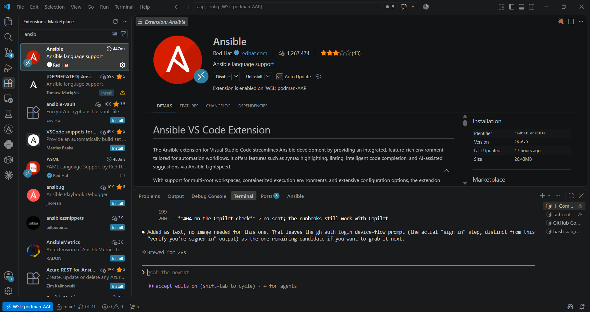

# Runbook 01 — Get your dev environment running

> **Skill:** `/setup-workstation` runs this whole runbook (it covers runbooks 00–01) for you, in Claude Code or GitHub
> Copilot CLI. Read the steps first, then let it drive.

> **Status:** **WSL-native (below) is the primary path** — confirmed working, and
> what's actually used day-to-day. The **[devcontainer path](#devcontainer-path-work-in-progress)**
> further down is a work in progress — it has needed several recent fixes
> (`remoteUser`, registry auth) and isn't fully validated end-to-end yet. Default
> to WSL-native unless you specifically need the container itself (for example,
> testing devcontainer changes).

## You will need

Needed either way:
- Runbook 00 complete (WSL2 installed and working).
- A **GitHub account** with access to your enterprise organization, and **GitHub
  Copilot** (a seat — checked in the Steps below).
- A **Red Hat login** for Automation Hub (or your org's private hub URL + token).
- **AAP connection details** for the production (Azure) instance: URL, a service
  account username, and password.

Needed only for the devcontainer path (currently work in progress):
- **Docker Desktop** *or* **Podman Desktop** on your Windows machine.
- The VS Code **Dev Containers** extension.

## You will learn

How to get Ansible + all the tools this kit needs running — via the WSL-native
path (recommended) or the dev container (work in progress, further down).
Either way you get the same toolchain Red Hat ships to customers —
`ansible-core`, `ansible-lint`, `yamllint`, `ansible-navigator`,
`ansible-creator`, `molecule`, `ansible-builder` — plus the `gh` CLI and Node.

## Steps

Work directly in your WSL2 distro through VS Code's **WSL Remote** connection
(title bar reads `[WSL: <distro>]`, not `[Dev Container: ...]`) — no container
build, no "Reopen in Container" prompt.

1. **Install VS Code.**

   

2. **Sign in to GitHub from the terminal:**
   ```bash
   gh auth login       # choose HTTPS, authenticate in the browser (device flow)
   ```

   ```text
   ? Where do you use GitHub? GitHub.com
   ? What is your preferred protocol for Git operations on this host? HTTPS
   ? How would you like to authenticate GitHub CLI?  [Use arrows to move, type to filter]
   > Login with a web browser
     Paste an authentication token
   ```

   Pick **Login with a web browser** — it prints a one-time code and a URL to open,
   then finishes once you approve it in the browser.

   **If you clone over SSH instead of HTTPS**, generate a key and add it to
   GitHub. Do this **inside WSL** (not on the Windows side) — same reasoning as
   keeping `~/.ansible.cfg` and vault passwords WSL-native: it stays local to
   this machine, not synced anywhere:
   ```bash
   ssh-keygen -t ed25519 -C "you@example.com"   # accept the default path, set a passphrase
   cat ~/.ssh/id_ed25519.pub
   ```
   Copy the printed line and paste it in at
   [github.com/settings/keys](https://github.com/settings/keys) → **New SSH
   key**. (Or skip the copy-paste: `gh ssh-key add ~/.ssh/id_ed25519.pub --title
   "aap_config WSL"` does the same thing from the CLI.)

3. **Check your Copilot seat:**
   ```bash
   gh api /user/copilot_billing
   ```
   Seat details = you're on an org-assigned Copilot Business/Enterprise plan.

   A `404` here does **not** necessarily mean Copilot is unavailable — this endpoint
   only returns data for org-assigned seats. An individual **Copilot Free** account
   (or Pro) legitimately 404s here while Copilot still works fine elsewhere (VS Code
   extension, Copilot CLI), just under Free-tier usage limits:

   ```text
   $ gh api /user/copilot_billing
   {
     "message": "Not Found",
     "documentation_url": "https://docs.github.com/rest",
     "status": "404"
   }
   gh: Not Found (HTTP 404)
   ```

   If Copilot Chat / the Copilot CLI genuinely don't work at all (not just rate
   limited), *that's* the real "no access" signal — ask your GitHub org admin (org
   Settings → Copilot → Access) rather than reading this 404 alone as a problem.

   > **AI Assist:** see [PROMPTS.md → rb01](../ai/PROMPTS.md#rb01) — paste the
   > 404 prompt if you hit that.

4. **Clone the repo inside the WSL2 filesystem**, then open it in VS Code via
   WSL Remote:
   ```bash
   # from inside your WSL2 distro
   gh repo clone <your-org>/aap_config
   cd aap_config
   code .
   ```
   > **AI Assist:** [PROMPTS.md → rb01](../ai/PROMPTS.md#rb01).

   VS Code attaches to the WSL distro directly — do **not** accept a "Reopen in
   Container" prompt if VS Code offers one. Confirm the connection via the
   remote indicator in the bottom-left status bar (same one shown in step 1).

5. **Install the Ansible toolchain directly in the WSL distro.** On the
   devcontainer path, `ansible-core`/`ansible-lint`/`ansible-navigator`/etc.
   come pre-installed from the Containerfile's base image
   (`registry.redhat.io/.../ansible-dev-tools-rhel9`). A bare WSL distro has
   none of that, so install `pip` first, then the same
   [`ansible-dev-tools`](https://github.com/ansible/ansible-dev-tools) package
   the base image ships:
   ```bash
   pip install ansible-dev-tools     # or: pipx install ansible-dev-tools
   ```
   ```text
   $ adt --version
   ansible-builder                  3.1.1
   ansible-core                     2.21.3
   ansible-creator                  26.8.0
   ansible-dev-environment          26.8.0
   ansible-dev-tools                26.8.0
   ansible-lint                     26.8.0
   ansible-navigator                26.8.0
   ansible-sign                     0.1.6
   molecule                         26.8.0
   pytest-ansible                   26.8.0
   tox-ansible                      26.8.0
   ```

6. **Answer the Automation Hub token prompt.** `bash .devcontainer/post-create.sh`
   works fine from a plain WSL shell — it doesn't require being inside a
   container, it just installs collections per
   [collections/requirements.yml](../../collections/requirements.yml) (it does
   **not** install Ansible itself — that's step 5 above). It asks for your
   **Automation Hub token** (from console.redhat.com → Automation Hub → API
   token) and writes `~/.ansible.cfg` to your WSL home directory:
   ```bash
   bash .devcontainer/post-create.sh
   ```

   > No prompt appeared? That is the good case — it only asks when `AH_TOKEN` is
   > unset. If you exported the variable first, the collections install
   > unattended.

   The simple, single-token case (no customer Private Automation Hub — see
   [below](#collections-from-a-customers-private-automation-hub) if you need
   that) writes this:

   ```ini
   [galaxy]
   server_list = rh_certified, rh_validated, community

   [galaxy_server.rh_certified]
   url = https://console.redhat.com/api/automation-hub/content/published/
   auth_url = https://sso.redhat.com/auth/realms/redhat-external/protocol/openid-connect/token
   token = <rh-ah-token>

   [galaxy_server.rh_validated]
   url = https://console.redhat.com/api/automation-hub/content/validated/
   auth_url = https://sso.redhat.com/auth/realms/redhat-external/protocol/openid-connect/token
   token = <rh-ah-token>

   [galaxy_server.community]
   url = https://galaxy.ansible.com/
   ```

   Never commit this file or paste a real token into any doc/PR — see
   [AGENTS.md](../../AGENTS.md).

7. **Install the VS Code extensions and Copilot CLI by hand.**
   `.devcontainer/devcontainer.json` normally installs the VS Code extensions
   automatically on container build (`redhat.ansible`, `redhat.vscode-yaml`,
   `GitHub.copilot`, `GitHub.copilot-chat`) — on the WSL-native path there's no
   container build step to do that, so install them from the Extensions panel
   once VS Code is connected via WSL Remote:

   

   GitHub Copilot CLI: `npm install -g @github/copilot`, or
   `gh extension install github/gh-copilot`. Claude Code CLI: install directly
   in WSL following Anthropic's standard install steps.

   ![GitHub Copilot CLI running in a VS Code terminal tab, connected via WSL Remote (title bar shows "aap_config [WSL: podman-AAP]")](../images/copilot-cli-wsl-vscode.png)

8. **Keep secrets in your WSL home directory.** Set up `~/.ansible.cfg` (done
   in step 6), your vault password file(s), and `~/.config/containers`
   (registry auth) directly under your **WSL home directory** — not inside the
   repo, and not inside a container. This is a deliberate choice: WSL2 runs
   local to the Windows host only, so secrets placed there don't risk being
   baked into a container image, build context, or anything that could leave
   the machine. See [04-secrets.md](04-secrets.md) for the vault/
   `connection.yml` setup itself.

## Collections from a customer's Private Automation Hub

Skip this unless you are working inside a customer environment that mirrors
collections into its own Private Automation Hub (PAH). Everyone else only
needs `AH_TOKEN` (step 6 above).

In a corporate setting you usually want **two** sources: the customer's
internal PAH first, with Red Hat's Automation Hub as the fallback.
[`post-create.sh`](../../.devcontainer/post-create.sh) already handles this —
you do not edit it. On the WSL-native path, set these before running it:

```bash
export AH_TOKEN='red-hat-automation-hub-token'   # console.redhat.com → Automation Hub → API token
export PAH_TOKEN='private-automation-hub-token'  # your PAH UI → Settings → API Token
export PAH_URL='https://pah.example.internal/api/galaxy'
```

On the devcontainer path, set these on the **Windows** host before launching
VS Code instead (`setx AH_TOKEN "..."`, etc.) — `devcontainer.json` passes all
three through via `remoteEnv`.

The resulting `~/.ansible.cfg` looks like this:

```ini
[galaxy]
server_list = customer_certified, customer_validated, rh_certified, rh_validated, community

[galaxy_server.customer_certified]
url = https://pah.example.internal/api/galaxy/content/published/
token = <customer-pah-token>

[galaxy_server.customer_validated]
url = https://pah.example.internal/api/galaxy/content/validated/
token = <customer-pah-token>

[galaxy_server.rh_certified]
url = https://console.redhat.com/api/automation-hub/content/published/
auth_url = https://sso.redhat.com/auth/realms/redhat-external/protocol/openid-connect/token
token = <rh-ah-token>

[galaxy_server.rh_validated]
url = https://console.redhat.com/api/automation-hub/content/validated/
auth_url = https://sso.redhat.com/auth/realms/redhat-external/protocol/openid-connect/token
token = <rh-ah-token>

[galaxy_server.community]
url = https://galaxy.ansible.com/
```

Why it is shaped that way:

- **Customer PAH entries come first** in `server_list`, so `ansible-galaxy`
  prefers internal content and only falls back to Red Hat Automation Hub, then
  community Galaxy.
- **PAH uses a plain token** — no `auth_url`. Red Hat Automation Hub uses
  SSO-based auth, which is what `auth_url` handles.
- **One token per hub.** The same PAH token covers both its `content/published/`
  (certified) and `content/validated/` endpoints; likewise for the Red Hat token.

> **Hard rule:** never commit this file or paste a real token into any doc/PR.
> This repo ships **no project-local `ansible.cfg`** — that would shadow the
> real one and break collection installs. See [AGENTS.md](../../AGENTS.md).

## How you know it worked

```bash
gh auth status
gh api /user/copilot_billing   # seat details, or a 404 — see step 3 above
ansible --version              # or: adt --version
ansible-galaxy collection list | grep infra.aap_configuration
gh copilot --version           # or: copilot --version, depending on which Copilot CLI you installed
```

```text
$ gh auth status
github.com
  ✓ Logged in to github.com account ericcames (/root/.config/gh/hosts.yml)
  - Active account: true
  - Git operations protocol: https
  - Token: gho_************************************
  - Token scopes: 'gist', 'read:org', 'repo', 'workflow'
```

```text
$ ansible-galaxy collection list | grep infra.aap_configuration
[WARNING]: Collection at '/usr/local/lib/python3.14/site-packages/ansible/_internal/ansible_collections/ansible/_protomatter' does not have a
MANIFEST.json file, nor has it galaxy.yml: cannot detect version.
infra.aap_configuration               4.7.0
infra.aap_configuration_extended      4.9.1
```

The `[WARNING]` about `ansible/_protomatter` is harmless — an internal ansible-core
bundled pseudo-collection with no version metadata, unrelated to this repo. As long
as both `infra.aap_configuration` lines show up with the versions pinned in
[collections/requirements.yml](../../collections/requirements.yml), you're good.
Docker/Podman Desktop should also be running, if you're on the devcontainer path.

## If it went wrong

- **404 on the Copilot check** → usually just means you're on individual Copilot
  Free/Pro rather than an org-assigned seat — normal, not an error. Confirm Copilot
  actually works (VS Code extension, Copilot CLI) before assuming there's a problem;
  if it truly doesn't work, ask your GitHub org admin (org Settings → Copilot →
  Access). Either way, the runbooks still work with Copilot Chat in VS Code or
  Claude Code, since every AI Assist prompt is plain text.
- **Corporate proxy blocks Copilot** → try `curl -v https://api.githubcopilot.com`
  to see if TLS is being intercepted; report it to your admin. Fall back to
  Copilot Chat or Claude Code.
- **Podman "cannot connect"** (devcontainer path) → ensure the Podman machine is
  started (`podman machine start`) and `dev.containers.dockerPath` is set to
  `podman`.
- **Collections didn't install** → your Hub token was blank or wrong. Re-run
  `bash .devcontainer/post-create.sh` and paste a fresh token.
- **Line-ending weirdness / scripts fail** → the repo enforces LF via
  `.gitattributes`; make sure you cloned fresh (don't copy files from a Windows
  editor that rewrote them to CRLF).
- **Copilot CLI missing** → optional; use Copilot Chat in VS Code or install the
  `gh copilot` extension. AI Assist prompts work anywhere.

## Devcontainer path (work in progress)

Everything below builds and enters the actual Podman/Docker container instead of
working directly in WSL. Use this only if you specifically need the container
itself — it isn't fully validated end-to-end yet (see the status note at the
top).

### Steps

1. **Install a container runtime.** Docker Desktop is simplest; Podman Desktop
   is the license-free alternative. If you use Podman, set VS Code setting
   `dev.containers.dockerPath` to `podman`.

   > The dev container is built on Red Hat's Ansible Dev Tools image from
   > `registry.redhat.io`, which pulls **without a login**. If your network
   > blocks it, or you see an authentication error during the build, log in once
   > with your Red Hat account and rebuild:
   > ```bash
   > podman login registry.redhat.io     # or: docker login registry.redhat.io
   > ```

2. **Clone the repo** (get your own copy on your machine):
   ```bash
   gh repo clone <your-org>/aap_config
   cd aap_config
   code .
   ```

3. **Reopen in Container.** VS Code will detect `.devcontainer/` and pop up
   "Reopen in Container" — click it. (Or Command Palette → *Dev Containers:
   Reopen in Container*.) First time takes a few minutes to build.

4. **Answer the post-create prompt.** It asks for your **Automation Hub token**
   (from console.redhat.com → Automation Hub → API token). Paste it. This writes
   `~/.ansible.cfg` inside the container's home directory and installs the
   pinned collections. *(You can skip and re-run
   `bash .devcontainer/post-create.sh` later.)*

   > No prompt appeared? That is the good case — it only asks when `AH_TOKEN` is
   > unset. If you exported the variable before launching VS Code, the
   > collections install unattended.

5. When it finishes, it prints **"Next step: open docs/runbooks/02-export.md"**.

### How you know it worked

Inside the container terminal:
```bash
ansible --version                       # shows ansible-core 2.16.x
ansible-navigator --version             # proves you are on the Dev Tools image
gh --version                            # the layered GitHub CLI, used by runbook 05
ansible-galaxy collection list | grep infra.aap_configuration   # shows 4.7.0
```

Same "If it went wrong" fixes as the WSL-native path above apply here too.

Next: [02-export.md](02-export.md).
